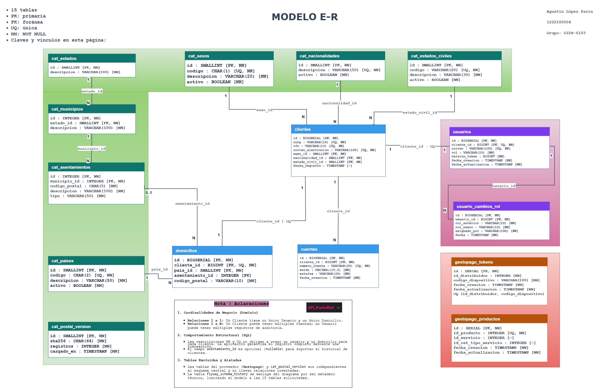
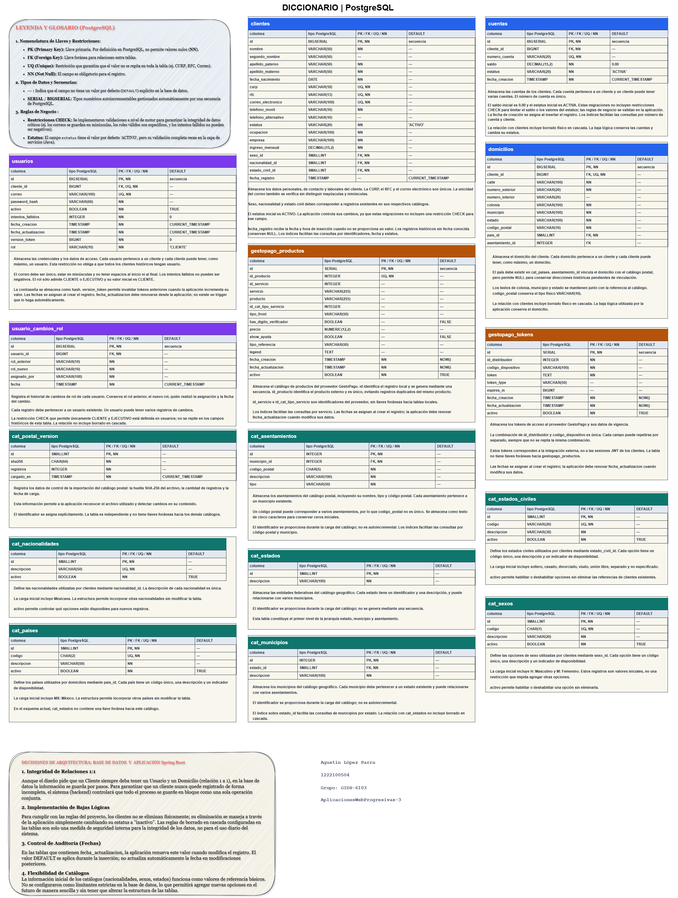

# Ambientar-Proyecto

API REST para registrar y administrar personas físicas. Cada alta crea su domicilio, cuenta y usuario de acceso en una operación transaccional. La solución incluye autenticación JWT, permisos CLIENTE/EJECUTIVO, consultas, catálogos mexicanos e integración de productos GestoPago.

**Tecnología:** Java 17 como nivel de compilación; JDK 21 para la ejecución comprobada; Spring Boot 3.4.0; PostgreSQL 17; Flyway; JUnit y JMeter.

## Guía de revisión del entregable

Este README es el documento técnico principal. La revisión puede seguir tres pasos: **ejecutar la instalación**, **contrastar el diseño con el código** y **consultar las evidencias**.

| Entregable del profesor | Acceso directo |
|---|---|
| Diagrama entidad–relación | Incluido en este README; [PDF](docs/diagramas/V3%20DIAGRAMA%20E%20R%20Integracion%20de%20clientes.pdf) y [editable](docs/diagramas/modelo-er-v8.drawio.xml) |
| Script de creación de base de datos | [Un único archivo SQL](scripts/crear-base-datos.sql), con iniciadores Windows y Linux |
| Código fuente completo | [Java](src/main/java/), [recursos](src/main/resources/) y Gradle Wrapper |
| API REST | Procedimiento de inicio, Swagger y contrato de rutas descritos abajo |
| Evidencias de pruebas | [Resultados funcionales](docs/evidencias/bruno-resultados-2026-10-09.json), [suite Java](docs/evidencias/suite-java.json) y [reportes JMeter](tests/jmeter/resultados/20261009-120812/) |
| Documento técnico | Este README; `docs/` contiene las explicaciones complementarias |

**Estado de la evidencia funcional:** 96 casos aprobados, 7 fallidos y 2 bloqueados. Los pendientes se detallan al final y no se presentan como funcionalidades acreditadas.

Acceso rápido: [Windows](#windows) · [Linux](#linux) · [Diseño de datos](#diseno) · [Solución Java y API](#solucion) · [Pruebas y resultados](#evidencias).

## Ejecución para la revisión: Windows y Linux

La base completa se prepara con **una orden**, utilizando el iniciador Windows o Linux mostrado abajo. El DDL está reunido en [`scripts/crear-base-datos.sql`](scripts/crear-base-datos.sql): crea una base nueva, las 15 tablas, sus secuencias, índices y restricciones, los catálogos personales y el historial de Flyway correspondiente al esquema entregado. A continuación, el iniciador carga el ZIP postal incluido mediante el importador Java. Ejecutar únicamente el SQL prepara el esquema; los iniciadores completan también sus datos postales.

V1–V8 se conservan como historial del desarrollo. No es necesario ejecutarlas por separado al utilizar el SQL de entrega. Su historial procede de la base QA comprobada; al arrancar, Flyway valida los archivos originales y reconoce el esquema en versión 8.

### Requisitos previos

| Requisito | Uso |
|---|---|
| JDK 21 | Ejecutar el JAR y compilar si se usa el código fuente |
| PostgreSQL 17 | Persistencia; usuario con permiso para crear una base |
| Cliente `psql` o PostgreSQL en Docker | Ejecutar el SQL único |
| ZIP postal incluido en `datos/` | Cargar automáticamente el catálogo al crear la base |
| Python 3 y JMeter 5.6.3 | Opcionales, para repetir la carga |

PostgreSQL debe estar iniciado. Si `psql` no está en PATH, añadir la carpeta `bin` de PostgreSQL o utilizar la alternativa Docker descrita más abajo. No se necesita instalar Gradle: el proyecto incluye su Wrapper. En una primera compilación necesita Internet para descargar dependencias.

El catálogo nacional ya está incluido en `datos/CPdescargatxt.zip`: **159,340 asentamientos, 2,478 municipios y 32 entidades**. Procede de [Correos de México](https://www.correosdemexico.gob.mx/SSLServicios/ConsultaCP/CodigoPostal_Exportar.aspx); se conserva completo, con su aviso original. La orden de creación ejecuta el SQL y después importa este ZIP en una transacción. No hay que descargarlo, descomprimirlo ni indicar una ruta. El [registro de origen y SHA-256](datos/README.md) permite verificar la copia entregada.

[Comprobación de creación y carga automática](docs/evidencias/instalacion-catalogo-incluido.json): base nueva, importación repetida sin duplicados y consulta HTTP del catálogo. Los iniciadores actualizados se ejecutaron en Windows y Git Bash; su sintaxis POSIX se verificó dentro de Linux/Docker. La ejecución completa con JVM Linux queda disponible para reproducirla siguiendo las mismas instrucciones.

<a id="windows"></a>

### Windows — PowerShell 7

Desde la raíz del proyecto, configurar la conexión y crear la base:

```powershell
java -version # Debe mostrar Java 21; configurar PATH o JAVA_HOME si hace falta.
$env:PGHOST = 'localhost'
$env:PGPORT = '5432'
$env:PGUSER = 'postgres'
$claveRevision = Read-Host 'Contraseña de PostgreSQL' -AsSecureString
$env:PGPASSWORD = [System.Net.NetworkCredential]::new('', $claveRevision).Password

.\scripts\crear-base-datos.ps1 -Base revision_hasani
```

Resultado esperado: `15` tablas de aplicación, `8` versiones de Flyway y el mensaje **Catálogo postal listo: 159340 asentamientos, 32 estados, 2478 municipios**. El catálogo queda cargado antes de iniciar la API:

```powershell
.\scripts\iniciar-api.ps1 -Base revision_hasani
```

El iniciador genera la clave JWT en memoria si no se configuró y compila el JAR si hace falta. Utiliza la contraseña de PostgreSQL del entorno; no la guarda en archivos. Esperar el mensaje `Started App` y abrir **http://localhost:8081/swagger-ui.html**. La API permanece en esa terminal; `Ctrl+C` la detiene.

<a id="linux"></a>

### Linux — terminal

Con Java 21 y PostgreSQL 17 disponibles, desde la raíz del proyecto:

```bash
java -version
export PGHOST=localhost PGPORT=5432 PGUSER=postgres
read -rsp 'Contraseña de PostgreSQL: ' PGPASSWORD; printf '\n'
export PGPASSWORD

sh scripts/crear-base-datos.sh revision_hasani
```

La misma orden carga el ZIP incluido. Cuando termine, iniciar la API:

```bash
sh scripts/iniciar-api.sh revision_hasani
```

El iniciador necesita `java` en PATH. Utiliza `openssl` para generar la clave JWT si no existe `JWT_SECRET`. El JAR y el esquema son los mismos que en Windows. Si no hay JAR, compila mediante `sh gradlew bootJar`. Esperar `Started App`, abrir **http://localhost:8081/swagger-ui.html** y detener con `Ctrl+C`.

La contraseña se solicita sin mostrarla ni escribirla literalmente en el historial de comandos. Las credenciales pertenecen al entorno del revisor.

### Alternativa: PostgreSQL en Docker

Si se utiliza un contenedor existente, sustituir únicamente la orden de creación:

```powershell
# Windows; nombre del contenedor y puerto según su instalación.
.\scripts\crear-base-datos.ps1 -Base revision_hasani -Contenedor postgres-dev
```

```bash
# Linux.
export DOCKER_CONTAINER=postgres-dev
sh scripts/crear-base-datos.sh revision_hasani
```

La API se ejecuta en el equipo y se conecta al puerto publicado en `PGPORT`. Para un contenedor nuevo, después de configurar `PGPASSWORD`, puede usarse:

```powershell
docker run -d --name postgres-revision -e "POSTGRES_PASSWORD=$env:PGPASSWORD" -p 5433:5432 postgres:17-alpine
$env:PGPORT = '5433'
docker exec postgres-revision pg_isready -U postgres
# Cuando informe accepting connections:
.\scripts\crear-base-datos.ps1 -Base revision_hasani -Contenedor postgres-revision
```

```bash
docker run -d --name postgres-revision -e "POSTGRES_PASSWORD=$PGPASSWORD" -p 5433:5432 postgres:17-alpine
export PGPORT=5433 DOCKER_CONTAINER=postgres-revision
docker exec postgres-revision pg_isready -U postgres
# Cuando informe accepting connections:
sh scripts/crear-base-datos.sh revision_hasani
```

En Docker, la importación Java se conecta desde el equipo al puerto publicado: `PGHOST`, `PGPORT`, `PGUSER` y `PGPASSWORD` deben corresponder a ese contenedor. Si falla sólo la importación, el esquema creado se conserva; corregir la conexión y ejecutar `scripts/importar-catalogo-postal.ps1 -Base revision_hasani` o `sh scripts/importar-catalogo-postal.sh revision_hasani`.

Estas alternativas ejecutan **el mismo SQL**; no son ocho pasos de migración. No ejecutar la creación dos veces sobre el mismo nombre: el script detecta una base existente y se detiene sin modificarla. Para volver a abrir una base creada, ejecutar sólo `iniciar-api`. Para otra instalación desde cero, elegir otro nombre de base.

### Qué comprobar al iniciar

1. Swagger abre en el puerto 8081.
2. `GET /catalogos/codigos-postales/37907` devuelve asentamientos con el CP solicitado.
3. `POST /clientes` crea cliente, domicilio, cuenta y usuario; devuelve 201.
4. `POST /auth/login` entrega un JWT. Usarlo en **Authorize** para consultar `/auth/me` y `/clientes/me`.
5. Consultar la cuenta y el saldo del mismo cliente; no se exponen contraseñas ni hashes.

El perfil de revisión `qa` usa PostgreSQL y las reglas reales de clientes. Desactiva la caché y dirige GestoPago a una dirección local para que la revisión no consuma el proveedor. No acredita la integración externa. Para esta última se necesitan Redis, credenciales GestoPago y la configuración normal del proyecto.

### Repetir JMeter en ambos sistemas

Preparar perfiles sintéticos mientras la API de revisión está iniciada:

```powershell
python scripts/preparar-datos-jmeter.py
.\scripts\ejecutar-jmeter.ps1 -JMeterHome (Join-Path $HOME 'Downloads/apache-jmeter-5.6.3')
```

```bash
python3 scripts/preparar-datos-jmeter.py
export JMETER_HOME="$HOME/Downloads/apache-jmeter-5.6.3" # Ajustar a su ruta.
sh scripts/ejecutar-jmeter.sh
```

Se ejecutan 1, 10 y 25 usuarios durante 60 segundos por nivel. Los JTL y dashboards se guardan en una carpeta nueva de `tests/jmeter/resultados/`. Para revisar el `.jmx` en la interfaz: `bin/jmeter.bat` en Windows o `sh "$JMETER_HOME/bin/jmeter"` en Linux, y **Archivo → Abrir → `tests/jmeter/clientes-local.jmx`**.

La preparación Python admite repetir la recuperación de sus propios perfiles QA sin borrar registros. No utiliza los datos personales del proyecto. El CSV queda en `.local-data`, fuera de Git y del paquete. Los [reportes ya entregados](tests/jmeter/resultados/20261009-120812/) se pueden abrir sin repetir la carga.

<a id="diseno"></a>

## Diagrama entidad–relación



<details>
<summary>Ver el diccionario completo de las 15 tablas</summary>



</details>

El modelo contiene **15 tablas de aplicación**; `flyway_schema_history` es una tabla adicional de infraestructura. Clientes se relaciona con domicilio y usuario mediante FK `NOT NULL` y `UNIQUE`, y con cuentas mediante una FK sin `UNIQUE`. El esquema permite 0..1 domicilio/usuario y 0..N cuentas por cliente; el servicio de registro garantiza la creación conjunta de las filas del alta nueva.

Estados → municipios → asentamientos forman la jerarquía postal. Un CP puede tener varias colonias. El domicilio selecciona un asentamiento compatible con su CP. La FK postal conserva nulabilidad para domicilios históricos sin correspondencia única; los registros nuevos requieren el asentamiento.

`usuario_cambios_rol` registra las asignaciones de rol. `gestopago_tokens`, `gestopago_productos` y `cat_postal_version` conservan su independencia física; no se dibujan FKs que no existen en SQL. La información laboral está integrada en la tabla `clientes`.

### Tipos de datos, almacenamiento e integridad

| Dato | Tipo implementado | Motivo y límite |
|---|---|---|
| IDs personales y claves de referencia | `BIGSERIAL` / `BIGINT` | Identidad generada y referencias del mismo tipo; enteros de 8 bytes |
| Catálogos personales y estados | `SMALLINT` | Claves de rango pequeño; enteros de 2 bytes |
| Municipios y asentamientos | `INTEGER` | Claves compuestas del catálogo dentro de su rango; enteros de 4 bytes |
| Nacimiento | `DATE` | Fecha sin hora |
| Fechas de registro y auditoría | `TIMESTAMP` | Fecha y hora; históricos desconocidos pueden conservar NULL |
| CURP, RFC y correo | `VARCHAR(18)`, `VARCHAR(13)`, `VARCHAR(100)` | Límites según contrato; restricciones de unicidad |
| Teléfono y cuenta | `VARCHAR(10)` y `VARCHAR(20)` | Identificadores textuales que conservan ceros iniciales |
| CP | `CHAR(5)` en catálogo; `VARCHAR(10)` heredado en domicilio | API de cinco dígitos; no se trata como cantidad numérica |
| Saldo e ingreso | `DECIMAL(15,2)` y `BigDecimal` en Java | Importes exactos con dos decimales |
| Estado habilitado | `BOOLEAN` | Valor lógico de catálogo/usuario/producto |
| Contraseña | `VARCHAR(60)` | Hash BCrypt; no se almacena la contraseña en texto |

Los tamaños de enteros corresponden al valor, sin incluir cabecera de fila ni índices. `VARCHAR(n)` establece un máximo de caracteres, no reserva siempre `n` bytes. `CHAR(n)` utiliza relleno y no aporta una ventaja general de rendimiento. La precisión de `NUMERIC/DECIMAL` tampoco implica almacenamiento fijo de todos sus dígitos. Fuentes: [tipos numéricos PostgreSQL 17](https://www.postgresql.org/docs/17/datatype-numeric.html) y [tipos de caracteres](https://www.postgresql.org/docs/17/datatype-character.html).

Las FKs, `NOT NULL`, `UNIQUE` y los CHECK de rol/intentos preservan las restricciones físicas correspondientes. Las reglas de edad, contraseña, ingreso positivo y opciones habilitadas se implementan en Java; no se atribuyen a un CHECK inexistente. El correo se normaliza y su unicidad se comprueba sin distinguir mayúsculas.

Se usan índices para relaciones, identificadores, CP, estatus y fecha. V3 también conserva índices explícitos sobre algunas columnas con `UNIQUE`; esos índices pueden resultar redundantes y deben revisarse mediante una migración posterior, sin modificar el SQL ya aplicado. Las consultas generales se paginan para limitar filas transferidas; no se afirma una medición de memoria total de la aplicación.

<a id="solucion"></a>

## Solución Java y reglas de negocio

La solución separa controladores REST, DTO de entrada/salida, servicios de negocio, repositorios y clientes de integración. Spring valida las entradas; los servicios comprueban reglas entre campos y autorizaciones. JPA/JDBC persisten en PostgreSQL y `sfTransactionManager` delimita las transacciones. OpenFeign/JAXB y MapStruct adaptan la integración GestoPago. Los exception handlers producen respuestas HTTP controladas y los logs registran operación, duración y tipo de fallo.

El alta crea **cliente + domicilio + cuenta ACTIVA con saldo 0 + usuario CLIENTE** en una sola transacción. El número de cuenta se genera con 20 dígitos; no se presenta como CLABE. Si falla el alta, se revierte el conjunto. Los DTO de consulta excluyen contraseña y hash.

### Validaciones

| Regla | Comprobación |
|---|---|
| Nombre | 3–38 caracteres; letras y espacios |
| Apellidos | 2–50 caracteres; letras y espacios |
| Nacimiento y edad | Fecha real pasada; al menos 18 años |
| CURP y RFC | Formato, fecha interna, normalización a mayúsculas y unicidad; RFC de 12 o 13 caracteres |
| Correo | Formato, longitud máxima 100 y unicidad normalizada |
| Teléfono | Diez dígitos |
| Ingreso | Decimal JSON positivo, hasta 13 enteros y 2 decimales |
| Contraseña | Mínimo 8 caracteres y máximo 72 bytes UTF-8; mayúscula, minúscula, dígito y símbolo; sin espacios/control |
| IDs de catálogo | Enteros JSON positivos, dentro del rango y correspondientes a opciones habilitadas |
| Domicilio | CP de cinco dígitos y asentamiento existente que corresponde al CP; etiquetas derivadas del catálogo |
| Tipos JSON | Se rechazan conversiones de cadenas, booleanos o decimales donde el contrato exige otro tipo |
| Actualización | CURP/RFC protegidos; correo sincronizado con usuario; cuenta y fecha original conservadas |

Los campos JSON desconocidos actualmente se ignoran; esto no permite asignar un rol, saldo o identidad desde el request porque el servicio los genera o controla. Las validaciones no verifican autenticidad oficial de CURP/RFC.

El login compara BCrypt y bloquea tras tres intentos incorrectos consecutivos. JWT utiliza firma HS256, issuer, audience, expiración y validación del usuario activo/rol/versión vigente. El cambio de contraseña invalida los tokens anteriores. La baja lógica conserva las filas, marca cliente/cuentas inactivos, desactiva usuario e invalida el acceso. Las FKs con cascada describen borrado físico SQL; el DELETE de esta API utiliza baja lógica.

### API REST y consultas

Registro y login reciben JSON. Las rutas protegidas requieren `Authorization: Bearer <JWT local>`.

| Método y ruta | Función | Acceso |
|---|---|---|
| `POST /clientes` | Alta completa | Público |
| `POST /auth/login` | Obtener JWT local | Público |
| `GET /auth/me` | Perfil de sesión | Autenticado |
| `GET /catalogos/sexos`, `/nacionalidades`, `/paises`, `/estados-civiles` | Opciones previas al registro, bajo prefijo `/catalogos` | Público |
| `GET /catalogos/codigos-postales/{cp}` | Asentamientos de un CP | Público |
| `GET /clientes/me` | Ficha propia | Propietario |
| `GET /clientes/{id}`, `/clientes/buscar` | Consulta individual/por identificador | CLIENTE propio; EJECUTIVO general |
| `GET /clientes` | Listado, filtros y paginación | EJECUTIVO |
| `GET /clientes/{id}/cuentas` | Cuentas del cliente | Propietario o EJECUTIVO |
| `GET /cuentas/{numeroCuenta}`, `/cuentas/{numeroCuenta}/saldo` | Cuenta y saldo | Propietario o EJECUTIVO |
| `GET /cuentas` | Listado paginado de cuentas | EJECUTIVO |
| `PUT /clientes/{id}` | Actualizar datos permitidos | Propietario o EJECUTIVO |
| `PUT /usuarios/{id}/password` | Cambiar contraseña | Propietario |
| `DELETE /clientes/{id}` | Baja lógica | Propietario o EJECUTIVO |
| `GET /usuarios/{id}` | Usuario sin credenciales | Propietario o EJECUTIVO |
| Rutas `/api/gestopago/productos` | Consulta/sincronización del proveedor | JWT local; configuración externa necesaria |

Se filtra por CURP, RFC, correo, número de cuenta, nombre, activo y rango de fechas. Los parámetros `page`, `size`, `ordenarPor` y `direccion` se validan; la paginación usa orden estable. Las fechas históricas sin dato permanecen NULL. La pertenencia se comprueba con la identidad del JWT y la base, no sólo con el ID de la URL. El registro público no concede EJECUTIVO; su asignación utiliza el [procedimiento auditado](scripts/asignar-ejecutivo.sql).

| HTTP | Significado |
|---|---|
| 200 / 201 / 204 | Consulta exitosa / alta creada / operación exitosa sin cuerpo |
| 400 | Validación, tipo JSON, fecha o filtros inválidos |
| 401 | Sin sesión válida o credenciales incorrectas, según el código del cuerpo |
| 403 | Operación general sin permiso |
| 404 | Recurso inexistente o ajeno al ámbito del cliente |
| 409 | Dato único duplicado |
| 5xx | Error de servidor o integración; requiere diagnóstico |

La integración de productos guarda el lote por `id_producto` con upsert transaccional, conserva identidad/fecha de creación e invalida caché después del commit. Los JWT locales son independientes del token del proveedor. La ejecución funcional reciente de estos endpoints respondió 500; está pendiente verificar su configuración y comportamiento antes de acreditar esa integración.

<a id="evidencias"></a>

## Pruebas y resultados

- [Instalación V1–V8](docs/instalacion-ejecucion.md): cero tablas iniciales, ocho migraciones exitosas, 15 tablas, 159,340 asentamientos, 2,478 municipios y 32 estados. Reinicio sin migraciones adicionales ni duplicados.
- Suite Java: **67 aprobadas, cero fallos y cero omisiones** con PostgreSQL y ZIP nacional configurados. [Resultado](docs/evidencias/suite-java.json).
- [Colección Bruno](tests/bruno): 105 casos. La ejecución HTTP automatizada del 09/10/2026 evaluó sus aserciones originales con Chai: **96 aprobados, 7 fallidos y 2 bloqueados**. [Resultados](docs/evidencias/bruno-resultados-2026-10-09.json) y [matriz actual](https://docs.google.com/spreadsheets/d/1wuJ65P2yGV9EE4FCUEvcD3ppr8lwz2MxvaRizK-WxH0/edit).
- [JMeter: plan y resultados](docs/jmeter-plan-resultados.md): 1, 10 y 25 usuarios, 60 segundos por nivel, login y consultas QA locales. [Plan editable](tests/jmeter/clientes-local.jmx).

| Usuarios JMeter | Muestras | Errores | Media ms | P95 ms | Máximo ms |
|---:|---:|---:|---:|---:|---:|
| 1 | 90 | 0 | 100.41 | 154 | 2606 |
| 10 | 924 | 0 | 73.86 | 170 | 1638 |
| 25 | 2029 | 0 | 140.24 | 417 | 2845 |

Las 3,043 muestras comprobaron HTTP y contenido. El plan utiliza login por hilo y cuatro consultas con pausa de 500 ms, rampa de 10 segundos y 60 segundos por nivel. JMeter, API y PostgreSQL comparten equipo; incluye arranque/calentamiento y no demuestra capacidad máxima de producción. Los [JTL y dashboards](tests/jmeter/resultados/20261009-120812/) y el [desglose por endpoint](tests/jmeter/resultados/20261009-120812/resumen.json) permiten revisar las cifras.

### Incidencias de la última ejecución funcional

| Casos | Resultado real | Trabajo pendiente |
|---|---|---|
| CP-014 y CP-017: altas válidas | 409 porque los perfiles ya existían; el caso esperaba 201 | Repetir el alta con datos QA nuevos o presentar la evidencia de su primera creación; no borrar personas para forzar el resultado |
| CP-025 y CP-026: RFC/correo duplicados | 409 por CURP duplicada antes del campo que comprueba el Test | Preparar fixtures con los demás identificadores únicos y repetir |
| CP-100–CP-102: catálogo GestoPago | 500 | Diagnosticar Redis/configuración/servidor y repetir con las dependencias disponibles |
| CP-103 y CP-104: sincronización | No enviados por precondición fallida | Ejecutar después de corregir el paso previo |

Un 409 de unicidad no acredita una prueba de alta 201. El 500 observado no demuestra por sí solo que el proveedor externo haya fallado. Estas incidencias quedan visibles para evitar presentar funcionalidades pendientes como completas.

### Correspondencia con los criterios de evaluación

| Criterio | Peso | Evidencia disponible |
|---|---:|---|
| Diseño de base de datos | 20% | ER, diccionario, tipos/restricciones y creación V1–V8 desde cero |
| Validaciones | 20% | Reglas Java/SQL, casos inválidos, suite y respuestas por campo; fixtures de dos duplicados pendientes de repetir |
| Implementación Java | 25% | Capas, DTO, transacciones, BCrypt/JWT y 67 pruebas Java aprobadas |
| API REST | 15% | Endpoints, Swagger, permisos y respuestas; integración GestoPago pendiente por 500 |
| Consultas y persistencia | 10% | Filtros, paginación, consultas propias, PostgreSQL y conservación tras baja |
| Documentación y evidencias | 10% | Este README, diagramas, matriz, resultados funcionales y JMeter |

La tabla identifica evidencia; no asigna una calificación ni afirma el cumplimiento de los casos pendientes.

## Paquete de entrega

El paquete reúne código, SQL único, migraciones originales, colección Bruno, diagramas, documentos y reportes. Puede incluir el JAR para ejecutar la revisión sin compilar. La estructura interna conserva las rutas de este README.

```powershell
# Windows, con el JAR ya compilado.
.\scripts\empaquetar-entrega.ps1 -IncluirJar
```

```bash
# Linux, con el JAR ya compilado.
python3 scripts/empaquetar-entrega.py --incluir-jar
```

Se genera en `outputs/entrega-<fecha>/`, con un manifiesto SHA-256 por archivo. Se excluyen configuraciones privadas, cachés, archivos IDE. Se incluyen el ZIP postal en `datos/` y su registro de origen. [Índice de entrega](docs/entrega-final.md).

La creación SQL y su iniciador Linux se comprobaron en PostgreSQL 17.11 sobre Linux/Docker. El arranque de la API desde ese esquema, la suite Java y los resultados JMeter se comprobaron en Windows. Los iniciadores Linux de API y carga se revisaron sintácticamente; la ejecución completa en una máquina Linux queda disponible para reproducción.
